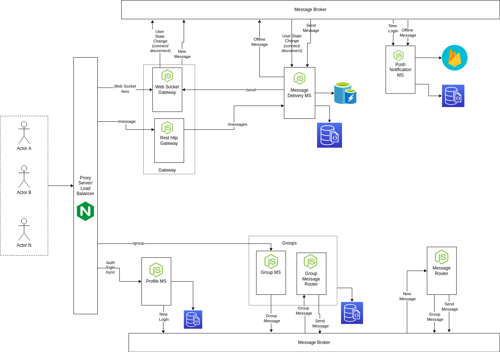

# Chat Server
[](code_of_conduct.md)
[](https://gitpod.io/#https://github.com/ramank775/chat-server) 

A chat server based on the microservice architecture to ensure high availability, high throughput, horizontal scalability.

## Architecture


### Components
- Nginx: Nginx act as API gateway as well as load balancer.
    - Responsibility
        - API Gateway
        - Authentication
        - Load Balancing
  
- Web Socket Gateway: It's handling client websocket connection and sending message to message broker
    - Responsibility
        - Maintaining Web Socket Connection
        - Forwarding event like `onConnect`, `onDisconnect`, `new-message` to message broker
        - Sending message back to client

- Rest Http Gateway: It handle rest call to send messages.
    - Responsibility
        - Send Message to message broker.

- Profile MS: Rest Api Service provides functionality like `login`, `auth`, `contact-sync` 
    - Responsibility
        - Login, Auth
        - Contact Sync

- Group MS: Rest Api Service provides functionality to `create`, `update`
    - Responsibility
        - Create Group
        - Add, Remove Members
        - Fetch groups

- Message Delivery MS: Message delivery in real time when the user is connected, syncing messages when user is offline
    - Responsibility
       - Maintaining User connection state.
       - Message push in real time when a user in connected.
       - Store message when the user is disconnected.
       - Guaranteed message delivery to the receiver.
       - Ability to sync message in background.

- Message Router: Route the incoming `new message` to respective destination
    - Responsibility
        - Parse message.
        - Redirect message to respective destination for e.g.
            - Route group message to Group Message Router.

- Group Message Router: Route the incoming group messages to respective destination
    - Responsibility
        - Fetch group users for particular user.
        - Update message meta with user list.
        - Redirect Message to respective destination.

- Push Notification: Deliver message to user when user is offline
    - Responsibility
        - Deliver message to offline user

### Message Format

```json
{
    "_v": 2.1,
    "id": "string",
    "head" : {
        "type": "chat|group|channel|bot|notification",
        "to": "username|group_id|channel_id|bot_id",
        "from": "username",
        "chatid": "chatid", // to be deperciated, added for backward comptibility only,
        "ephemeral": "true/false",
        "category": "user|system",
        "contentType": "json|text|video|audio|location|form",
        "action": "message|ack|subscribe|unsubscribe|join|leave|create|add-member|remove-member"
    },
    "meta": {
        "hash": "md5:hash",
        "content_hash": "md5:hash",
        "generate_ts": 123455667890
    },
    "body": {
        "text": "Hello this a text message",
        "ts":123455667890
    }
}
```

```json
{
    "_v": 2.0,
    "id": "string",
    "head" : {
        "type": "chat|group|channel|bot|notification",
        "to": "username|group_id|channel_id|bot_id",
        "from": "username",
        "chatid": "chatid", // to be deperciated, added for backward comptibility only
        "contentType": "json|text|video|audio|location|form",
        "action": "message|ack|subscribe|unsubscribe|join|leave|create|add-member|remove-member"
    },
    "meta": {
        "hash": "md5:hash",
        "content_hash": "md5:hash",
        "generate_ts": 123455667890
    },
    "body": {
        "text": "Hello this a text message",
        "ts":123455667890
    }
}
```

#### Mapping with previous Message format

```json
{
    "msgId": "id",
    "from": "head.from",
    "type": "head.content_type",
    "to": "head.to",
    "chatId": "head.to",
    "text": "body.text",
    "state": "n/a",
    "module": "head.type",
    "action": "head.action",
    "chatType": "head.type"
}
```

## Directory Structure

| Name |  Description |
| ---- |  ----------- |
| .github | Configuration files related to github like workflows, funding |
| .gipod | Configuration files for gitpod dev enviroment setup |
| .husky | git hooks configuration via [husky](https://typicode.github.io/husky) |
| deployment | Deployment scripts |
| docs | Docs related to the project |
| helper | Common utility functions |
| libs | Project specific libs like base class for microservice, resource configuration and initialization |
| services | Microservice |
| www | Web based testing interface |
| .env.tmpl | Environment template file |
| .gitpod.yml | Gitpod configuration file |
| LICENSE | Project License file (MIT) |
| package.json | Node project configuration file |
| README.md | Project description and other details |

## How to setup

### Use Gitpod as development environment
Click on the Gitpod badge it will start the fully setup development environment.

 [](https://gitpod.io/#https://github.com/ramank775/chat-server) 

### Development environment on local machine

### Prerequisites
- [Apache Kafka](https://kafka.apache.org/) / [Nats](https://nats.io/)
- Mongodb
- Nginx
- Firebase project 
- Redis

### Steps
- Clone the master branch of the project
- Install dependencies

    ``` 
    npm install 
    ```
    Or 
    ``` 
    yarn install 
    ```
- Make copy of `.env.tmpl` to `.env` and update the required variables
    ```
    cp .env.tmpl .env
    ```
- Initialize Message Broker 
    ```
    cd deployment/scripts
    ```
    Setup Kafka
    ```
    ./init-kafka.bash ${KAFKA_INSTALLATION_DIRECTORY} .env
    ```
    OR

    Setup Nats
    ```
    ./init-nats.bash .env
    ```

- Open project in vscode
- Start the required microservice from `RUN and DEBUG` option
- (Optional) Start nginx using the configuration [deployment/config/nginx.config](./deployment/config/nginx.dev.config)


## Deployment
For deployment guide refer to [deployment/README.md](./deployment/README.md).

# Resources

## API specs doc 
[](https://god.gw.postman.com/run-collection/20439391-376454b4-ccc4-4fb5-8b88-5a3a3392e6d1?action=collection%2Ffork&collection-url=entityId%3D20439391-376454b4-ccc4-4fb5-8b88-5a3a3392e6d1%26entityType%3Dcollection%26workspaceId%3Def561179-c2db-47e5-85ce-10440f20555c)

- API documentation [here](https://documenter.getpostman.com/view/20439391/Uyr5neME)

- Open API specs 3.0 [here](./docs/openapi.yaml)

## Blog posts
To follow the update keep a eye on vartalap blogs on [blog.one9x.org](https://blog.one9x.org)
Some of the relevent blogs are:
- [Vartalap: Open Source Personal Messaging App](https://blog.one9x.org/vartalap/2021/04/04/vartalap-personal-messaging-app.html)
- [Vartalap: Chat Server Architecture V1](https://blog.one9x.org/vartalap/2021/04/10/vartalap-chat-server-architecture.html)
- [Vartalap: Chat Server Architecture V2](https://blog.one9x.org/vartalap/2021/05/22/vartalap-chat-server-architecture-v2.html)
- [Vartalap: Chat Server Architecture V2.1](https://blog.one9x.org/vartalap/2021/06/26/vartalap-chat-server-architecture-v2-1.html)


## LICENSE
 [MIT](./LICENSE)
